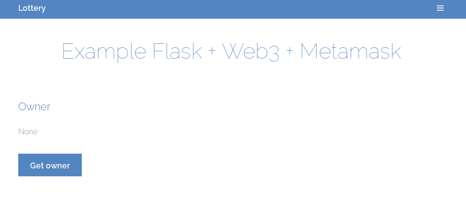

## Week 12: DApps

### Question 1

Using Python, Web3py, Web3js, Metamask, and Flask, develop a (DApp) web
application able to manage the decentralized lottery created previously. It
should:
* Compile and deploy lottery's smart contract(s) automatically
* Interact with lottery's contract when required; for example, send money to winner(s)
* Trigger interactions manually from a web GUI
* Customers can bet through the web app using Metamask

**See an example below.**

### Question 2

Let's launch a crowdsale for your decentralized lottery.  To do so, you make use
of an Initial Coin Offering (ICO), implemented via the ERC20 token standard.

```
+--------------+--------------------------------------------------------------+
| Start time   | 28-11-2018                                                   |
+-----------------------------------------------------------------------------+
| End time     | 12-12-2018                                                   |
+-----------------------------------------------------------------------------+
| Symbol token | MLC                                                          |
+-----------------------------------------------------------------------------+
| Total supply | 1 Million of MLC                                             |
+-----------------------------------------------------------------------------+
```

### Warm-up: Python3 + Flask + Web3 + Metamask basic example

The *12_src/webapp* folder provides a simple DApp example that interacts with a
smart contract deployed in Ganache. Please analyze, study, and run this Dapp.
Make sure Metamask is connected properly and using an existing account.

```console
$ pip3 install py-solc flask web3
$ python3 -m solc.install v0.4.25
$ export PATH=$HOME/.py-solc/solc-v0.4.25/bin:$PATH
$ python3 server.py
```

**Screenshot:**



